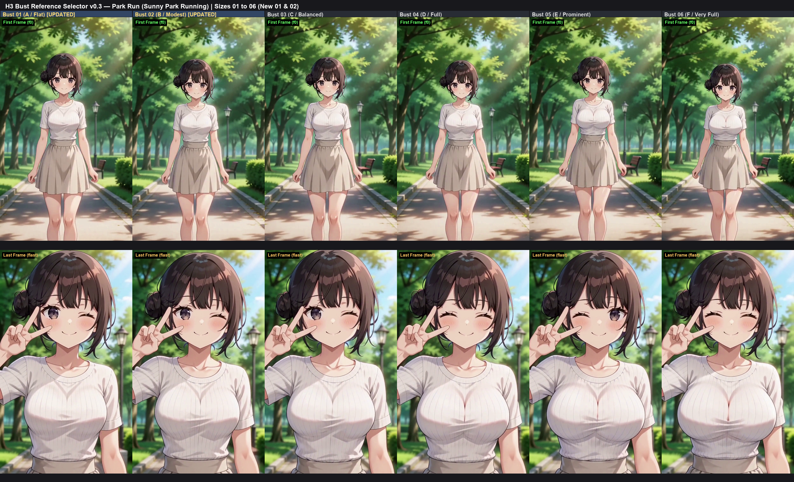

# ComfyUI-H3-Bust-Reference

[English](README.en.md)

MiniMax H3 Ref2VA向けの三面図参照画像セレクターです。上半身の参照画像6種類（01〜06）を選び、その役割を説明する英文をプロンプトに追加します。番号は素材の選択用で、実際のカップサイズや連続的な数値制御を意味しません。結果はモデル、衣装、キャラクター画像、プロンプトに依存します。

## 作例

[](assets/comparison_park_run_first_last_2x6.png)

公園を走る作例の開始・終了フレーム比較。画像をクリックすると原寸で表示できます。

## インストール

先に通常のMiniMax H3 Ref2VAが動くComfyUI環境を用意してください。このノードだけで動画生成環境が完成するわけではありません。ComfyUI-Managerへの登録は前提にせず、以下の手動導入を利用できます。

1. GitHubの「Code」からZIPを取得して展開するか、そこに表示されるURLでcloneします。
2. `__init__.py`、`nodes.py`、`assets` を `ComfyUI/custom_nodes/ComfyUI-H3-Bust-Reference/` の直下に配置します。ZIP展開による二重フォルダーに注意してください。
3. ComfyUIを再起動し、`H3 Bust Reference Selector` を追加します。カテゴリは `MiniMax-H3/Bust Reference` です。

ノード自体はComfyUIのPython環境にあるPyTorch・NumPy・Pillowを使います。別のPython環境へのインストールやモデルの自動ダウンロードは行いません。

## サンプルの必要条件

`sample_workflow_three_view.json` はComfyUI画面用のJSONです。API形式ではありません。

- [ComfyUI](https://github.com/Comfy-Org/ComfyUI)：`MiniMaxH3ReferenceToVideo`、`MiniMaxH3SigmaShift`、CLIPLoaderの `minimax` に対応した版。
- [ComfyUI-KJNodes](https://github.com/kijai/ComfyUI-KJNodes)：`MiniMaxLowVRAMAttention`、`MiniMaxChunkFeedForward` に対応した版。
- 下表のモデルと、自分が利用権限を持つ成人キャラクターの画像。これらは同梱しません。

モデル入手先は [ComfyUI向け変換モデル](https://huggingface.co/Kijai/MiniMax-H3_comfy) と [MiniMax H3公式](https://huggingface.co/MiniMaxAI/MiniMax-H3) を参照し、選んだ重みの利用条件を確認してください。配置先はComfyUIの `models/` からの相対パスです。

| 種類 | サンプルのファイル名 | 配置先 |
|---|---|---|
| Ref2VAモデル | `minimax_h3_ref2va_pruned_int8_convrot.safetensors` | `diffusion_models/` |
| テキストエンコーダー | `qwen3vl_32b_minimax_h3_nvfp4_awq.safetensors` | `text_encoders/` |
| 映像VAE | `minimax_h3_video_vae_int8_convrot.safetensors` | `vae/` |
| 音声VAE | `minimax_h3_audio_vae_fp32.safetensors` | `vae/` |
| 4ステップLoRA | `minimax_h3_ref2v_turbo_4step_v0.1_comfyui_bf16.safetensors` | `loras/` |

OSごとのパス区切りに依存しないよう、サンプルはLoRAを `loras/` 直下に置く指定です。既存のサブフォルダーを使う場合は、読み込み後にLoRAを一覧から選び直してください。他のモデルも実際の名前・配置に合わせて選択します。任意の別モデルやLoRAへの置換が同じ設定で動くとは限りません。

モデル共有は**実行するComfyUIの** `extra_model_paths.yaml`、または起動引数 `--extra-model-paths-config` で設定します。モデルの追加後は再起動・一覧更新が必要です。

## 使い方

1. サンプルJSONをComfyUIにドラッグ＆ドロップします。
2. `LoadImage` の空欄に自分のキャラクター画像をアップロードして選択します。
3. モデル5件を確認し、必要に応じて選び直します。
4. `bust_size` を01〜06から選び、`base_prompt` を編集して実行します。

```text
LoadImage.IMAGE ──────────────────→ H3 Ref2VA.ref_image_0 (<Picture 1>)
H3 Bust Reference Selector.IMAGE ─→ H3 Ref2VA.ref_image_1 (<Picture 2>)
H3 Bust Reference Selector.PROMPT → H3 Ref2VA.prompt
```

`ref_image_slot` は `ref_image_1` にします。この設定は文章の番号だけを決め、接続の検出・変更は行いません。画像は **`ref_image_0` から空きを作らず接続**してください。H3は渡された画像順に `<Picture 1>` から番号を付けます。

サンプルは832×1408、124フレーム、24 fps、4ステップ、固定seedです。VRAM・RAM・所要時間は環境依存です。出力先は `output/H3-Bust-Reference/` です。

## ノード仕様

| 入力 | 内容 |
|---|---|
| `bust_size` | 01〜06の選択式。画像間の補間はしません |
| `ref_image_slot` | `ref_image_0`〜`ref_image_8`。既定は `ref_image_1` |
| `base_prompt` | 空欄不可のH3プロンプト |
| `mode` | `Three-View Turnaround` のみ。旧呼び出し用の互換入力 |

出力は `IMAGE`（RGB、float32、`[1,H,W,3]`、0〜1）と `PROMPT`（文字列）です。役割文は成人女性の `<Subject 1>` を対象とします。

役割文は `subject_definitions:` の直後に追加し、見出しがなければ先頭に作ります。対象番号に独自定義がある場合は保持します。旧版が生成した既知の定型文と完全一致する場合だけ三面図用に更新し、他の画像番号の定義は変更しません。旧ワークフローに残った不要な参照番号の文章は手動で削除してください。

旧版で入出力数・ウィジェット順が異なるワークフローは、ノードを置き直して再接続してください。

## トラブルシューティング

- **赤い／欠落したノード**：ComfyUIの起動ログ、導入先、H3標準ノード、KJNodesを確認。
- **モデルが候補にない**：配置・ファイル名・共有モデル設定を確認し、一覧から選び直す。
- **画像がない**：LoadImageで画像を設定。三面図は `assets/bust/bust_01_3view.png`〜`bust_06_3view.png` が必要。
- **SaveVideoの入力エラー**：ComfyUIを更新し、必要ならSaveVideoを追加し直してCreateVideoの出力を接続。formatとcodecをautoに設定します。
- **体型が期待どおりでない**：参照番号・接続・役割文を確認し、衣装やキャラクター画像の影響も比較する。

## 検証範囲

ローカルのComfyUI 0.36.0・KJNodes 1.5.2を参照して構成を確認しました。最低対応バージョンの保証ではありません。CPUで6画像の読込、プロンプト保持・旧定型文更新、入力検証、サンプル配線をテストしています。Windows・RTX 4070（12 GB）で、サンプルをAPI形式に変換し、同じ画像・seed・設定で01と06を各1本生成しました。832×1408、124フレーム、24 fps、音声あり、全フレームのデコード成功を確認しています。サンプルのプロンプトは、この検証で使った正面から横向きへ回る2Dアニメの内容です。

検証では自分のキャラクター画像とローカルのLoRA配置を指定しました。配布版では利用者が画像・モデルを選択する必要があります。別OS、クリーンインストール環境、配布JSONのブラウザー操作は未検証です。生成結果の体型差・品質は利用者が映像を見て判断してください。

開発用テストはComfyUIと同じPythonで `python -m unittest -q test_nodes.py` を実行します。GPU生成は行いません。

## ライセンス

コード・ドキュメント・サンプルJSONは [MIT](LICENSE)、三面図6枚は [CC0 1.0](ASSET_LICENSE.md) です。画像は作者がChatGPTで生成しました。外部ソフトウェア・モデルは [THIRD_PARTY_NOTICES.md](THIRD_PARTY_NOTICES.md) を参照してください。

本プロジェクトはMiniMax公式の製品ではありません。MIT・CC0は外部モデル、入力素材、生成動画の利用条件を置き換えません。
